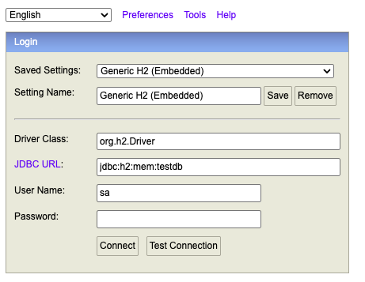
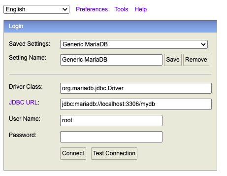
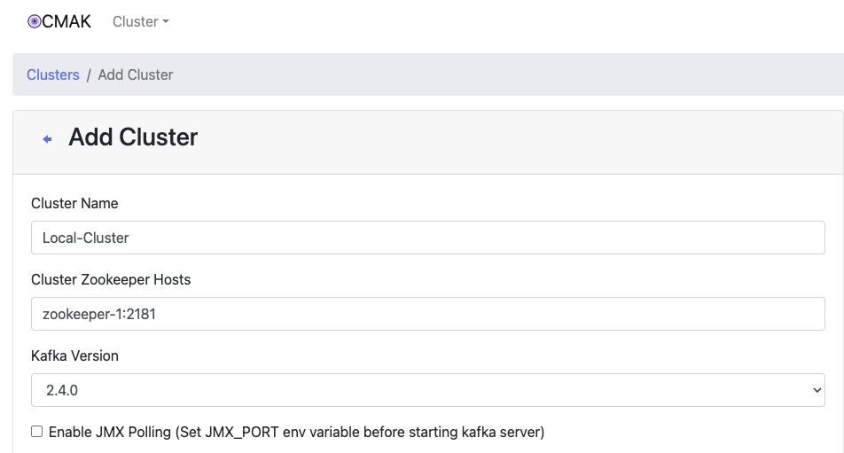
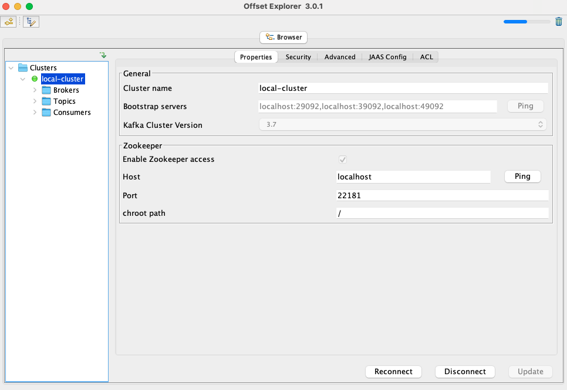

# Spring Cloud gateway 학습

Spring Cloud로 개발하는 마이크로서비스 애플리케이션(MSA)

강의 학습 내용 실습 자료

https://inf.run/4n2P6

## 프로젝트별 설명

| 프로젝트                     | 설명                      | 포트     | 비고                        |
|----------------------------|--------------------------|---------|-----------------------------|
| config-service             | 설정(구성) 서버             | 8000    |                             |
| gateway-first-service      | first-service 예제        | 8081    | netflix zuul 사용 예제1       |
| gateway-second-service     | second-service 예제       | 8082    | netflix zuul 사용 예제2       |
| spring-cloud-gateway       | 게이트웨이(메인)             | 8000    |                             |
| spring-cloud-eureka        | 유레카 서버                 | 8761    |                             |
| spring-cloud-eureka-client | 유레카 클라이어트 예제         | 0(랜덤)  | 유레카 클라이어트 예제           |
| spring-cloud-zuul-service  | netflix zuul 예제         | 8000    | deprecated로 gateway로 대체   |
| user-service               | 사용자 서비스               | 8001    |                             |
| order-service              | 주문 서비스                 | 8002    |                             |
| catalog-service            | 카탈로그 서비스              | 8003    |                             |

## Local 개발환경을 위한 docker compose
- config-service 경로
- 실행방법
  ```
  $ cd docker && docker-compose up -d
  ```
- 도커 종료방법
  ```
  $ cd docker && docker-compose down -v
  ```

## h2 console을 이용한 db접속
### h2


### h2(user-service)
http://localhost:8001/h2-console

### h2(order-service)
http://localhost:8002/h2-console

### h2(catalog-service)
http://localhost:8003/h2-console

### mariaDb


## kafka 관리 툴
### kafka manager(CMAK)
http://localhost:9000/

클러스터 추가 필요
<br/>


### kafka ui
http://localhost:8085/

### Offset Explorer3

