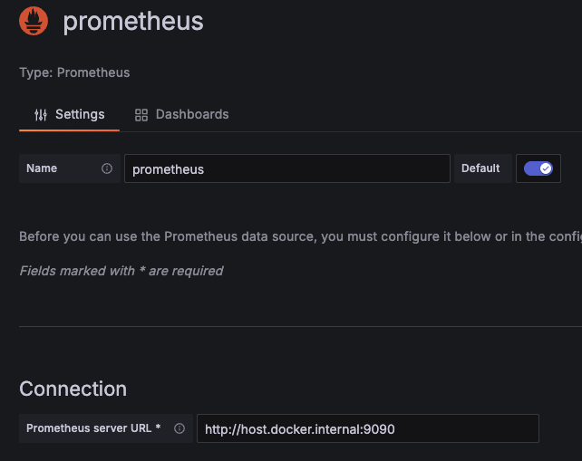
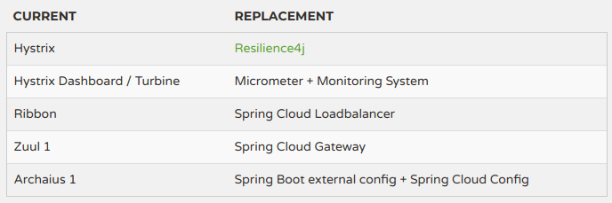
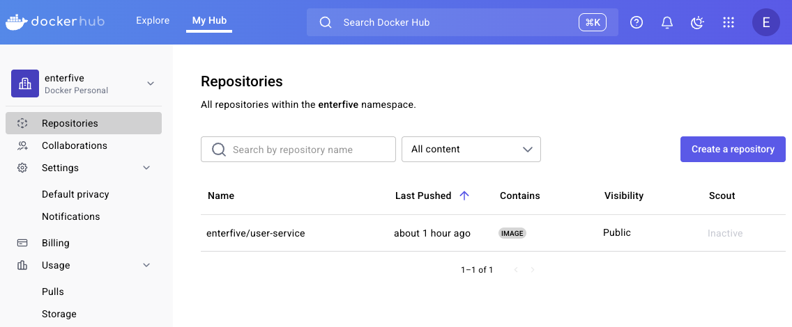

# Spring Cloud gateway 학습

Spring Cloud로 개발하는 마이크로서비스 애플리케이션(MSA)

강의 학습 내용 실습 자료

https://inf.run/4n2P6

## 프로젝트별 설명

| 프로젝트                     | 설명                      | 포트     | 비고                        |
|----------------------------|--------------------------|---------|-----------------------------|
| config-service             | 설정(구성) 서버             | 8000    |                             |
| gateway-first-service      | first-service 예제        | 8081    | netflix zuul 사용 예제1       |
| gateway-second-service     | second-service 예제       | 8082    | netflix zuul 사용 예제2       |
| spring-cloud-gateway       | 게이트웨이(메인)             | 8000    |                             |
| spring-cloud-eureka        | 유레카 서버                 | 8761    |                             |
| spring-cloud-eureka-client | 유레카 클라이어트 예제         | 0(랜덤)  | 유레카 클라이어트 예제           |
| spring-cloud-zuul-service  | netflix zuul 예제         | 8000    | deprecated로 gateway로 대체   |
| user-service               | 사용자 서비스               | 8001    |                             |
| order-service              | 주문 서비스                 | 8002    |                             |
| catalog-service            | 카탈로그 서비스              | 8003    |                             |


## Local 개발환경을 위한 docker compose
- config-service 경로
- 실행방법
  ```
  $ cd docker-spring-cloud && docker-compose up -d
  ```
- 도커 종료방법
  ```
  $ cd docker-spring-cloud && docker-compose down -v
  ```

## h2 console을 이용한 db접속
### h2


### h2(user-service)
http://localhost:8001/h2-console

### h2(order-service)
http://localhost:8002/h2-console

### h2(catalog-service)
http://localhost:8003/h2-console

### mariaDb


## kafka 관리 툴
### kafka manager(CMAK)
http://localhost:9000/

클러스터 추가 필요
<br/>


### kafka ui
http://localhost:8085/

### Offset Explorer3


## kafka connect rest API
### kafka sink connector 등록
docker compose로 실행할 경우, url에 localhost 대신 mariadb 입력
```
POST
http://localhost:8083/connectors/
{
  "name":"my-order-sink-connect",
  "config":{
      "connector.class":"io.confluent.connect.jdbc.JdbcSinkConnector",
      "connection.url":"jdbc:mariadb://mariadb:3306/mydb",
      "connection.user":"user",
      "connection.password":"1234",
      "auto.create":"true",
      "auto.evolve":"true",
      "delete.enabled":"false",
      "tasks.max":"1",
      "topics":"orders"
  }
}
```

### kafka connector 조회
```
GET
http://localhost:8083/connectors/
```

### kafka connector 삭제
```
DELETE
http://localhost:8083/connectors/
```

### kafka connector 플러그인 조회
```
GET
http://localhost:8083/connector-plugins
```

### kafka connector 상태 조회
```
GET
http://localhost:8083/connectors/{커넥터 이름}/status
http://localhost:8083/connectors/my-order-sink-connect/status
```

### zipkin server
http://localhost:9411/

### prometheus
http://localhost:9090/

### grafana
http://localhost:3000/

### grafana 프로메테우스 데이터소스 설정


### spring cloud replacement


## docker 명령어
### 도커 이미지 생성할 jar 파일 생성
```
./gradlew bootJar
```
build/libs/ 디렉터리 밑에 jar 파일이 생성

### docker build (docker 이미지 파일 생성)
```
docker build --tag {docker hub 계정}/user-service:1.0 .
docker build --tag enterfive/user-service:1.0 .
```
### docker push
```
docker push {docker hub 계정}/user-service:1.0
docker push enterfive/user-service:1.0
```


### docker image 조회
```
docker images
```

### docker image 삭제
```
docker images 명령어로 조회하여 image id 확인
docker rmi {imageId}
```

### docker pull
```
docker pull {docker hub 계정}/user-service:1.0
docker pull enterfive/user-service:1.0
```

### docker run
```
docker run enterfive/user-service:1.0
```

### docker 프로세스 확인
```
docker ps -a
```

### docker container 확인
```
docker container ls -a
```


### docker container 중지
```
docker stop {container id}
```

### docker 중지된 컨테이너 블필요한 리소스 삭제
```
docker system prune
```

### docker 네트워크 확인
```
docker network ls
```

### docker 사용자 정의 네트워크 생성
```
docker network create --gateway 172.18.0.1 --subnet 172.18.0.0/16 ecommerce-network
```

### docker 사용자 정의 네트워크 상세 확인
```
docker network inspect ecommerce-network
```

### docker rabbitMQ
```
docker run -d --name rabbitmq --network ecommerce-network \
 -p 15672:15672 -p 5672:5672 -p 15671:15671 -p 5671:5671 -p 4369:4369 \
 -e RABBITMQ_DEFAULT_USER=guest \
 -e RABBITMQ_DEFAULT_PASS=guest rabbitmq:management
```

### config-service 도커 이미지 생성할 jar 파일 생성
```
./gradlew bootJar

docker build --tag enterfive/config-service:1.0 .
```

### config-service 도커 push
```
docker push enterfive/config-service:1.0
```

### config-service 도커 run
```
docker run -d -p 8888:8888 --network ecommerce-network \
  --name config-service enterfive/config-service:1.0
```

### spring-cloud-eureka 도커 이미지 생성할 jar 파일 생성
```
./gradlew bootJar

docker build --tag enterfive/spring-cloud-eureka:1.0 .
```

### spring-cloud-eureka 도커 push
```
docker push enterfive/spring-cloud-eureka:1.0
```

### spring-cloud-eureka 도커 run
```
docker run -d -p 8761:8761 --network ecommerce-network \
  --name spring-cloud-eureka enterfive/spring-cloud-eureka:1.0
```

### gateway-service 도커 이미지 생성할 jar 파일 생성
```
./gradlew bootJar

docker build --tag enterfive/gateway-service:1.0 .
```

### gateway-service 도커 push
```
docker push enterfive/gateway-service:1.0
```

### gateway-service 도커 run
```
docker run -d -p 8000:8000 --network ecommerce-network \
-e "spring.cloud.config.uri=http://config-service:8888" \
-e "eureka.client.serviceUrl.defaultZone=http://spring-cloud-eureka:8761/eureka/" \
--name gateway-service \
enterfive/gateway-service:1.0
```

### zipkin 도커 run
```
docker run -d -p 9411:9411 \
 --network ecommerce-network \
 --name zipkin \
 openzipkin/zipkin
```

### prometheus 도커 run
```
 --network ecommerce-network \
 --name prometheus \
 -v /Users/greencar/repo/github/spring-cloud-study/config-service/docker-spring-cloud/prometheus/prometheus.yml:/etc/prometheus/prometheus.yml \
 prom/prometheus
```

### grafana 도커 run
```
 --network ecommerce-network \
 --name grafana \
 grafana/grafana
```